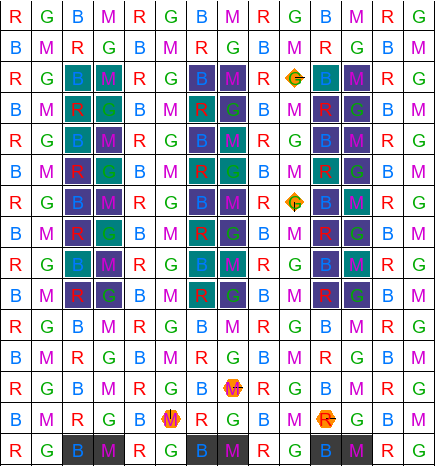

# Deep Warehouse — VLC & Centralized RL for AGVs

A grid-based warehouse environment for **Automated Guided Vehicles (AGVs)** with **Visible Light Communication (VLC)-based localization** and **centralized control**.  
This project extends the [Task Assignment Robotic Warehouse (TA-RWARE)](https://github.com/uoe-agents/task-assignment-robotic-warehouse) environment by replacing heuristic controllers with a **Central Agent** trained via **Proximal Policy Optimization (PPO)**.

---

## 🏭 Environment Description

### What does it look like?

The environment is a **discrete warehouse grid**:

- **Shelves (`S`)** store items.  
- **Pathways (`-`)** are navigable lanes overlaid with a **VLC grid**.  
  Each cell emits a unique **light identifier** (Red, Green, Blue, Magenta) enabling cell-level localization.  
- **Drop zones (`D`)** are delivery points.  
- **Walls (`#`)** bound the environment.  

AGVs are represented as **hexagons** moving across pathways. They continuously read VLC IDs and report their position to a **Central Agent**, which:  
- Assigns tasks,  
- Plans routes,  
- Resolves conflicts,  
- Avoids deadlocks/collisions.  

<p align="center">
  
</p>

### Action Space
- AGVs: {N, S, E, W, Idle}.  
- Central Agent outputs **global assignments and paths**.  
- PPO policy optimizes efficiency beyond heuristics.

### Observation Space
- **Global**: full grid state (shelves, drop zones, AGVs, VLC).  
- **Partial**: local view + VLC cell ID.  

### Dynamics
- **Collisions** prevented via central coordination.  
- **Deadlocks** resolved by retreat + task reassignment fallback.

### Rewards
- **+1.0** → successful delivery.  
- **Penalty** → collisions, deadlocks, idle steps.  
- PPO learns to maximize throughput and reduce congestion.

---

## 🔧 Installation

### Requirements
- Python 3.10–3.11  
- (Optional) GPU for PyTorch  

### Steps
```bash
git clone https://github.com/AJMC123/deep-warehouse-vlc.git
cd deep-warehouse-vlc
python -m venv .venv
.venv\Scripts\activate   # Windows
source .venv/bin/activate # macOS/Linux
pip install -r requirements.txt
```

👉 Pin NumPy:
```bash
pip install numpy==1.26.4
```

For headless rendering:
```bash
export PYGLET_HEADLESS=true   # Linux/macOS
$env:PYGLET_HEADLESS="true"   # Windows PowerShell
```

---

## 🚀 Getting Started

### Run Heuristic baseline
```bash
python scripts/run_heuristic.py --episodes 100 --output logs/heuristic.json
```

### Run Central Agent (rule-based)
```bash
python scripts/run_centralagent.py --episodes 500 --output logs/central.json
```

### Train PPO Central Agent
```bash
python scripts/run_centralagent_ppo.py   --env tarware-tiny-3agvs-2pickers-globalobs-v1   --train_steps 200000
```

### Evaluate PPO
```bash
python scripts/eval_saved_ppo.py   --model logs/ppo_run/ppo_central_final.zip   --episodes 50
```

Logs (JSON/CSV) are written to `logs/`.

---

## 📦 Example (Gym API)
```python
import gymnasium as gym
env = gym.make("tarware-tiny-3agvs-2pickers-globalobs-v1", render_mode="human")

obs, info = env.reset()
for _ in range(200):
    action = env.action_space.sample()
    obs, reward, term, trunc, info = env.step(action)
    if term or trunc:
        obs, info = env.reset()
env.close()
```

---

## 📊 Results
A short demo video is available in [`docs/demo.mp4`](docs/demo.mp4), showing:  
- VLC grid overlay  
- AGVs navigating under central PPO control  
- Comparison vs heuristic baseline  

---

## 📚 Citation
If you use this project in academic work, please cite:

> Carvalho, A.J.M. *Guidance of Autonomous Vehicles through Visible Light Communication*. MSc Thesis, Instituto Superior de Engenharia de Lisboa, 2025.

Also acknowledge the original base environment:  
> MacAlpine, P. *Task Assignment in Robotic Warehouse (TA-RWARE)*, Univ. of Edinburgh, 2022.  

---

## 📜 License
This project inherits the **MIT License** from the original TA-RWARE environment.  
See [LICENSE](LICENSE) for details.
